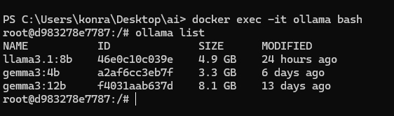

# aiSandbox-JAVA-SPIRNG

# 🤖 Local AI Assistant with LangChain4j, Ollama & Spring Boot

This project demonstrates how to build a **local AI-powered assistant** using `LangChain4j`, `Spring Boot`, and `Ollama`, enabling tool-calling, Retrieval-Augmented Generation (RAG), chat memory, Redis.

---

## 🔥 Features

- 🧠 **Local LLMs** (e.g., Gemma 3B, LLaMA 3.1 8B) with Ollama
- 📥 **RAG with ChromaDB**: Local document embedding and retrieval
- 🧰 **@Tool Integration**: Math calculator, Artist file writer
- 📚 **Custom metadata injection** for enhanced prompt building
- 🧾 **Redis-based chat memory**
---

## 🧠 Local LLM Setup with Ollama

To run this project locally with large language models:

```bash
docker compose up -d
docker exec -it ollama bash
ollama pull gemma3:4b 
ollama pull llama3.1:8b 
```


---
## Tech Stack
- **Spring Boot 3.5.3**
- **JAVA 21**
- **LangChain4j**
- **Ollama**: for local models
- **Redis**: chat memory
- **Chroma**: document RAG vector DB
- **Docker Compose**


